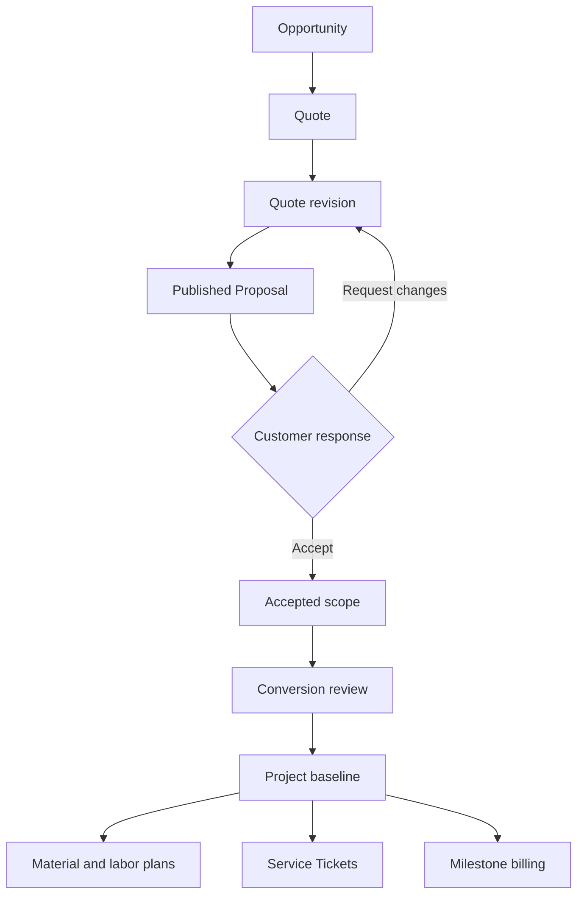

# Commercial Operations V1 Architecture

## Status and baseline

- Architecture status: approved product decisions, implementation not started
- Repository baseline: `main` at `02e789781376e1e8236893f78ccc04d939c7efb0`
- Decision date: August 27, 2026
- Delivery track: additive feature work isolated from the deployed field-test track

This document defines the next bounded context for Ops Portal V2:

`Opportunity -> Quote -> Revision -> Published Proposal -> Acceptance -> Project / Commercial Baseline -> Material Plan / Labor Budget -> Billing`

It is the implementation contract for Commercial Operations V1. Current Service Ticket, Visit, field execution, closeout, review, Billing Handoff, Invoice, and Payment behavior must remain unchanged unless a checkpoint explicitly adds an integration point with characterization coverage.

## Product purpose

Ops Portal V2 began as an FSM-first system, but the current product boundary is broader. Commercial Operations connects the existing Customer and Catalog domains to the existing Projects, field operations, Billing, and Payments domains.

The reference model combines:

- D-Tools Cloud's Opportunity pipeline, internal quote organization, Locations, Systems, Phases, margin visibility, and Project handoff;
- Portal.io's customer-facing web proposal, client visibility controls, comments, acceptance, payment schedules, and engagement history; and
- Ops Portal's canonical Customers, Catalog, Package recipes, Projects, Service Tickets, field execution, Billing, Payments, organization scope, authorization, and immutable audit history.

The goal is not to clone D-Tools or Portal.io. It is to progressively replace the NewDay workflows currently split across D-Tools Cloud, Portal.io, Zoho, and related SaaS products with one internally owned operating model.

## Scope boundary

Commercial Operations V1 includes:

1. One organization-configurable Opportunity pipeline with Kanban and List views.
2. Opportunity records, ownership, follow-up Tasks, files, notes/calls/emails, and a unified activity timeline.
3. Multiple Quotes per Opportunity and immutable revision history.
4. A Catalog-backed Quote builder organized by hierarchical Location, System, Phase, Category, and item type.
5. Products, Services, Packages, priced Allowances, and customer-selectable optional lines.
6. Cost, sell, markup, margin, line discount, document discount, tax, and approval calculations.
7. Budgetary Estimate, Quick Quote, Full Project Proposal, and Change Order templates.
8. Published customer web Proposals, PDFs, email delivery, secure links, media, comments, views, reminders, and audit history.
9. Typed identity, drawn signature, consent, email verification where required, and immutable acceptance evidence.
10. Payment schedules, draft deposit Invoices, and later draft milestone Invoices.
11. Accepted-scope conversion into a new or existing Project with Project templates, Workstreams, Milestones, selected Service Tickets, material planning, and labor budgeting.
12. Change Orders as explicit post-acceptance deltas.

V1 does not include:

- inventory balances, reservations, receipts, transfers, purchasing, vendors, or purchase orders;
- automated jurisdiction tax lookup or accounting/legal tax determination;
- general-ledger or accounting synchronization;
- customer accounts or a general customer portal;
- collecting a deposit inside the Proposal acceptance flow;
- service plans, subscriptions redesign, recurring charge automation, or saved payment methods;
- AI-generated scope, drawings/CAD, or advanced engagement scoring;
- edits to accepted scope, issued Invoices, Catalog history, field evidence, or Package standard recipes.

Inventory and Purchasing will later consume the Project material plan created here. Actual material usage will remain a separate execution record and will never overwrite estimated Package demand or the accepted commercial baseline.

## Existing integration contracts

Commercial Operations must reuse these existing contracts rather than create competing implementations:

| Existing contract | Required reuse |
| --- | --- |
| Active Organization middleware and membership capabilities | Every office and public-token boundary resolves one organization and enforces capability/policy scope. |
| `document_sequences` | Opportunity, Quote, and Change Order numbers use locked organization/year sequences. |
| `AuditRecorder` / `audit_events` | Safe system and staff activity remains append-only. Sensitive values stay out of audit metadata. |
| Catalog master records | Products, Services, Packages, Categories, UOMs, Variants, and recipes remain canonical definitions. |
| Catalog transaction snapshots | Quote lines copy immutable source identity, descriptions, UOM, cost/sell defaults, taxability, and Package demand. |
| `ProjectWorkflow` and Project policies | Conversion creates or extends Projects through the Projects bounded context. |
| `ServiceTicketCreator` and Project Ticket linking | Selected conversion Tickets use the canonical transactional creation path and dual authorization. |
| `InvoiceWorkflow`, `InvoiceCalculator`, and Invoice policies | Deposit and milestone billing create ordinary draft Invoices with commercial provenance. |
| Private file and signature storage patterns | Proposal media, PDFs, and signatures use opaque keys, private disks, hashes, authorized delivery, and cleanup jobs. |
| Organization identity and branding | Publications snapshot the active organization profile and selected brand assets. |

Current merged migrations are immutable. Commercial Operations uses new additive, reversible migrations only.

## Bounded-context model

Commercial Operations owns potential work, commercial estimates, publications, responses, and accepted scope. It references but does not own Customers, Contacts, Service Locations, Catalog records, Projects, Service Tickets, Invoices, or Payments.

### Aggregate distinction

- **Opportunity** is the sales pipeline container.
- **Quote** is an internal estimating document attached to an Opportunity.
- **Revision** is one version of the Quote. Only a Draft revision is editable.
- **Published Proposal** is the immutable customer presentation of one revision.
- **Acceptance** freezes customer choices, commercial totals, terms, signer evidence, and document content.
- **Change Order** is a Project-owned commercial document containing only post-acceptance deltas.
- **Project commercial scope** is the ordered set of one or more accepted Proposals and accepted Change Orders mapped to a Project.

One Opportunity may contain multiple Quotes. One Opportunity may produce multiple accepted Proposals. Each accepted Proposal is mapped exactly once to either a new Project or an existing compatible Project.

## Organization configuration

### Commercial settings

Add one `organization_commercial_settings` row per Organization. It owns:

- default Proposal expiration: 30 days;
- default tax rate source: the existing organization Billing setting;
- overall gross-margin approval floor: 2,000 basis points (20%);
- effective-discount approval ceiling: 1,500 basis points (15%);
- approval toggles for any manual Catalog sell-price override, any below-cost line, and terms overrides;
- configurable Proposal reminder offsets, initially 7 and 2 days before expiration;
- default customer visibility settings;
- link/signature statement versions;
- notification policy; and
- current default template identifiers.

Commercial settings contain explicit columns or versioned child records for operational rules. Do not create an unbounded catch-all settings JSON field.

### Opportunity stages

Add organization-scoped `opportunity_stages` with stable semantic kinds and configurable display properties:

| Initial stage | Semantic kind | Default probability | Manual movement |
| --- | --- | ---: | --- |
| New | `new` | organization setting | Quote-capable users |
| Qualifying | `qualifying` | organization setting | Quote-capable users |
| Quoting | `quoting` | organization setting | Quote-capable users |
| Presented | `presented` | organization setting | System, Manager, or Admin |
| Won | `won` | 100% | System, Manager, or Admin |
| Lost | `lost` | 0% | Authorized Opportunity users |

The Organization may change stage names, colors, ordering, and default probabilities. V1 has one pipeline. The protected semantic kinds `presented`, `won`, and `lost` cannot be deleted while referenced. Additional open stages may be added later without changing lifecycle code.

Sending or sharing the first Proposal moves the Opportunity to Presented. A customer acceptance moves it to Won. Before any acceptance exists, a customer change request clones a Draft revision and moves the Opportunity to Quoting. Once any Proposal has been accepted, the Opportunity remains Won while other already-published Proposals may still be accepted or changed. Managers and Admins may manually set Presented or Won; the override is audited and does not fabricate a Proposal acceptance or accepted scope. Won is final. Lost may be reopened. Lost reason and note are optional.

### Systems and Phases

Add organization-scoped default `commercial_systems` and `commercial_phases`. Quote revisions copy selected defaults into revision-owned snapshots. Authorized Quote users may add revision-specific values without changing the organization defaults.

Examples:

- Systems: Network, Surveillance, Audio, Video, Access Control, Security.
- Phases: Design, Rough-In, Trim, Final, Programming, Commissioning.

### Content, terms, and templates

Add organization-scoped:

- `commercial_content_blocks` for reusable Scope of Work sections;
- versioned `commercial_terms_sets` for selectable terms;
- `proposal_templates` and ordered `proposal_template_sections`; and
- Project conversion templates described later.

V1 seeds four editable template types:

1. Budgetary Estimate
2. Quick Quote
3. Full Project Proposal
4. Change Order

Templates control section order, branding, default visibility, acceptance availability, and PDF presentation. Scope blocks and terms are copied into the revision/publication snapshot; later library edits do not change published history. Terms overrides require approval.

## Numbering

Use `document_sequences` with the Organization-local year and row locking:

- Opportunity: `OPP-2026-0042`
- Quote: `Q-2026-0104`
- Quote revision display: `Q-2026-0104-V1`
- Change Order: `CO-2026-0012`
- Change Order revision display: `CO-2026-0012-V1`

The sequence value may exceed four digits. A published Proposal uses the revision display number and does not create a competing Proposal number.

## Proposed additive schema

The names below are the target architecture. A checkpoint may split a migration for safe review, but it must preserve these ownership and immutability rules.

### Opportunity tables

| Table | Purpose |
| --- | --- |
| `organization_commercial_settings` | Organization pricing, expiry, reminder, visibility, and acceptance defaults. |
| `opportunity_stages` | One configurable pipeline with protected semantic outcomes. |
| `opportunities` | Number, Customer, optional site/contact, owner, stage, primary active Quote, priority, estimated value/close, probability override, lead/referral/classification, and closure metadata. |
| `opportunity_tasks` | Assigned follow-ups with due dates and completion state. |
| `opportunity_activities` | Staff-entered notes, call records, and email summaries. |
| `opportunity_attachments` | Private files using the existing opaque-storage pattern. |
| `commercial_user_preferences` | Per-user Kanban/List selection, saved filters, and List columns. |

`opportunities.customer_id` is required. `service_location_id` and `primary_contact_id` are nullable during qualification and must belong to the Opportunity Customer when present. Customer, site, and contact records remain canonical and are never copied into Opportunity-owned master records. At most one Quote is designated primary/active for pipeline value. Once Won through customer acceptance, the pipeline value becomes the sum of accepted Proposal totals under that Opportunity.

### Commercial document and revision tables

Quotes and Change Orders share the same revision, calculation, approval, publication, and acceptance mechanics. A common Commercial Document aggregate avoids two subtly different implementations.

| Table | Purpose |
| --- | --- |
| `commercial_documents` | Type (`quote` or `change_order`), immutable number, title, Opportunity or Project owner, and document lifecycle. |
| `commercial_revisions` | Version, status, source revision, currency, tax, discounts, totals, terms/scope snapshots, and freeze timestamps. |
| `commercial_revision_locations` | Revision-owned hierarchical area tree. |
| `commercial_revision_systems` | Revision-owned System snapshots. |
| `commercial_revision_phases` | Revision-owned Phase snapshots. |
| `commercial_revision_sections` | Ordered Scope and presentation content copied from reusable blocks or authored for the revision. |
| `commercial_revision_lines` | Product, Service, Package, or Allowance line with immutable source/effective pricing and dimension assignment. |
| `commercial_revision_line_components` | Editable Quote-specific Package component snapshots and internal demand. |
| `commercial_payment_milestones` | Ordered percentage/fixed schedule that must reconcile to the revision total. |
| `commercial_revision_approvals` | Requested trigger snapshot, decision, actor, reason, and timestamps. |
| `commercial_revision_media` | Private images/diagrams/documents or validated embedded-video URLs. |

`commercial_documents` enforces exactly one parent shape:

- `quote`: requires `opportunity_id`, forbids `project_id`;
- `change_order`: requires `project_id` and the current Project commercial baseline, forbids `opportunity_id`.

Revision-owned dimensions are cloned with a revision. Quote Locations are not Service Locations. The Service Location is the property/site; revision Locations form a hierarchy such as `Main House -> First Floor -> Living Room`.

### Publication, engagement, and acceptance tables

| Table | Purpose |
| --- | --- |
| `proposal_publications` | Immutable presentation snapshot for exactly one approved revision, selected template, visibility, branding, totals, expiry, PDF state, and content hash. |
| `proposal_recipients` | Named email recipients and unique hashed access tokens. |
| `proposal_share_links` | Revocable generic hashed access tokens. Raw tokens are never stored. |
| `proposal_delivery_attempts` | Email/PDF delivery state, safe failure code, recipient, and timestamps. |
| `proposal_engagement_events` | Every page view, PDF download, comment, verification, reminder, expiration, extension, and response. |
| `proposal_comments` | Customer/staff threads attached to the Proposal, section, or line. |
| `proposal_email_verifications` | Short-lived hashed verification challenges with rate limits and attempt state. |
| `proposal_acceptances` | One terminal acceptance, signer identity, consent/statement snapshot, signature evidence, accepted snapshot/hash, and audit metadata. |
| `proposal_acceptance_line_selections` | Exact included/excluded state for every optional line at acceptance. |
| `accepted_payment_milestones` | Frozen accepted schedule used by deposit and Project billing. |

View IP addresses must be available to authorized staff because that is an explicit requirement. Store the displayable IP value encrypted at rest, plus a one-way normalized hash only if needed for rate limiting or abuse detection. Store the user agent with a bounded length. Do not copy raw IP addresses, signer email, signer title, signature path, comment bodies, or access tokens into `audit_events.metadata`.

### Project integration tables

| Table | Purpose |
| --- | --- |
| `project_templates` | Organization-owned conversion template. |
| `project_template_workstreams` | Ordered Workstream definitions. |
| `project_template_milestones` | Ordered Project Milestone definitions and optional billing trigger mapping. |
| `project_commercial_scopes` | One accepted Proposal or Change Order mapped once to a Project, with delta and resulting contract totals. |
| `project_material_plan_lines` | Append-only signed Product demand by accepted scope, Location, System, Phase, and Package component. |
| `project_labor_budget_lines` | Append-only signed Service/labor demand, estimated hours, cost, and sell values. |
| `project_billing_milestones` | Accepted payment milestone mapped to a Project Milestone and invoice state. |
| `commercial_conversion_runs` | Idempotent review/commit record, mapping snapshot, actor, and result. |
| `invoice_commercial_milestones` | Unique provenance link from a draft/issued Invoice to one accepted payment milestone. |

Project material and labor plans are append-only by commercial scope. A Change Order adds signed delta rows rather than rewriting the accepted baseline. Aggregated current requirements are calculated from those rows. This preserves estimate-to-change-to-actual provenance for later Inventory and job costing.

## Catalog extensions required by quoting

The existing Catalog remains authoritative, but quoting needs cost and Package pricing capabilities that current transaction snapshots do not yet provide.

### Service cost defaults

Add organization-scoped labor-role cost defaults and an optional default role on a Catalog Service. A Service may also carry an explicit default internal cost per sales unit. Cost resolution order is:

1. Service-specific internal cost;
2. selected/default labor-role cost scaled to the Service estimate; or
3. unresolved cost, which is visible internally and prevents a false margin calculation.

Technician pay, payroll, and employee compensation are not part of this model. These are estimating cost defaults only.

### Product cost basis

Retain `catalog_products.default_cost_cents` and `default_cost_quantity_millis` as the source cost basis. Quote snapshots store both values and use checked integer half-up scaling. Do not reduce pack/roll costs to prematurely rounded floating-point unit costs.

### Package pricing

Extend Package pricing to support:

- fixed Package price; and
- component-sum price.

A Quote editor may tailor the revision's snapshotted Package components without changing the Catalog recipe. Each component snapshot retains Product/Service identity, UOM, quantity, waste, internal cost, sell basis, and customer visibility. The customer sees one Package line by default; the publication may reveal selected components. The Project material/labor plans use the accepted revision component snapshot, not the later Catalog recipe.

### Non-Catalog entry

There are no orphan custom commercial lines. Attempting to enter a non-Catalog Product or Service opens an Add Catalog Item overlay. The overlay enforces existing `catalog.manage` and `catalog.pricing.manage` rules, saves the canonical record, and then inserts its snapshot into the revision. A user without Catalog authority cannot bypass the Catalog; the UI must direct that user to an authorized Catalog manager.

Allowance lines are the one intentional non-Catalog sellable type because they represent an unresolved selection, not an unknown Catalog item.

## Quote builder behavior

### Workspace

The Quote builder is an Office `workspace` page. It opens grouped by Location and can regroup the same lines by:

- Location;
- System;
- Phase;
- Category; or
- item type.

Grouping never duplicates a line. Each line retains independent Location, System, Phase, and Catalog Category dimensions. Desktop provides the dense builder; mobile/tablet provide a responsive review/edit card experience without squeezing the desktop grid.

The builder must support search-first Catalog selection, bulk dimension assignment, copy/move, quantity editing, stable ordering, autosave with optimistic concurrency, and explicit revision state. Only Draft revisions are editable.

### Line types

- **Product**: Catalog Product snapshot and future Product demand.
- **Service**: Catalog Service/Variant snapshot; supports hourly and fixed-price selling.
- **Package**: one sell line plus editable internal Product/Service component snapshots.
- **Allowance**: named priced placeholder with Location/System/Phase and tax behavior.

Catalog Services support existing pricing models, including hourly and flat/fixed pricing. Estimated labor may come from direct Service lines or Package components. Internal estimated labor cost uses Catalog Service or labor-role defaults.

### Optional lines

An optional line is part of the immutable publication but excluded from the initial total until selected. Customers select optional lines before acceptance. The web Proposal recalculates totals server-side and client-side for responsiveness; the server result is authoritative. Acceptance records the included/excluded state of every optional line.

### Allowances

An Allowance has a priced amount and customer-safe description. After acceptance, staff resolve it to Catalog items for planning. Selection within the allowance changes the Project plan without changing the accepted contract total. Only the positive or negative price variance requires a Change Order.

## Commercial calculation rules

All amounts use integer cents, quantities use thousandths, and percentage/rate values use basis points. Use checked integer arithmetic and deterministic half-up division. Floating-point math is prohibited.

For the currently included mandatory and selected optional lines:

1. Scale effective unit sell price by quantity to produce line gross sell.
2. Apply and cap the line-level fixed or percentage discount.
3. Sum post-line-discount values.
4. Calculate and cap the Quote-level fixed or percentage discount.
5. Allocate the Quote discount proportionally across positive lines, distributing remainder cents in stable line order.
6. If the Customer is tax-exempt, tax is zero for all lines and the exemption snapshot is retained.
7. Otherwise, apply the revision tax rate only to each explicitly taxable line after both discount layers.
8. Sum subtotal, line discounts, Quote discount, tax, and total.

The default tax rate comes from `organization_billing_settings.default_tax_rate_basis_points`. V1 does not derive a rate from the Service Location. An authorized manual override requires a reason and an audit record. Customer tax exemption requires an organization-scoped exemption flag/reference in the Customer domain and is snapshotted into the revision/publication.

Cost and margin are internal only:

- Product cost scales the snapshotted cost basis.
- Service cost scales the snapshotted Service/labor-role cost basis.
- Package cost sums accepted component costs, including waste where applicable.
- Gross profit = net pre-tax sell after discounts minus estimated cost.
- Gross margin basis points = gross profit divided by net pre-tax sell.
- Markup basis points = gross profit divided by estimated cost.

Quote editors may start with the Catalog sell price, enter a sell price directly, or calculate it from markup or margin. The effective sell price is always persisted explicitly so later calculations do not depend on a live Catalog value.

## Approval policy

Publishing is blocked when any of these conditions is true and no valid approval exists for the current revision hash:

- overall gross margin is below 20%;
- effective discount from the Catalog-based price exceeds 15%, including both line and Quote discounts;
- any line is sold below its resolved cost;
- any Catalog sell price was manually overridden, whether upward or downward; or
- selected terms were edited outside an approved organization terms version.

Approval requests store trigger kinds and safe numeric snapshots. Managers/Admins with the approval capability approve or reject. Any later financial, terms, option, quantity, or scope edit invalidates the approval by changing the revision content hash.

Cost/margin visibility is a separate capability. Hidden UI controls never replace server authorization.

## Revision and publication lifecycle

### Revision states

`Draft -> Pending Approval -> Approved -> Published`

Published terminal/response states are:

- Changes Requested
- Accepted
- Expired
- Superseded
- Withdrawn

If no approval trigger exists, the system may record a policy pass and move Draft directly to Approved. Publishing freezes the revision and creates a separate immutable publication snapshot. Published content is never edited.

Customer view is an engagement event, not a revision status.

### Customer change request

A change request:

1. records customer comments and the response event;
2. marks the current publication Changes Requested;
3. clones its revision, dimensions, lines, components, sections, media, and payment schedule into the next Draft version; and
4. moves the Opportunity to Quoting.

When a later revision is published, the prior change-requested publication becomes Superseded. Prior links remain viewable as historical, non-actionable records.

### Expiration and extension

Expiration defaults to 30 days. Expired Proposals remain viewable but cannot be accepted.

An extension requires an Admin price review comparing publication Product/sell snapshots with the current Catalog. The reviewer may:

- extend the existing publication unchanged, updating expiration metadata only and recording the review; or
- create a new Draft revision if pricing or scope must change.

No other publication content may change during extension.

Customers do not formally decline in V1. They use Request Changes or allow the Proposal to expire. Staff may withdraw a publication, leaving a viewable, clearly marked, non-actionable record.

## Customer presentation

### Visibility defaults

By default, customers see:

- individual sell-line prices;
- labor as one subtotal per Location or System; and
- Location/area totals.

Manufacturer/model numbers and Product images are hidden by default. Each publication may change permitted visibility settings before it is published. Internal costs, margin, Package demand, internal notes, approval history, and labor cost are never customer-visible.

Package contents appear as one line by default, with an optional component-reveal setting.

### Delivery

V1 supports:

- email sent by Ops Portal;
- copied secure sharing links; and
- PDF download or attachment.

Each emailed recipient receives a unique high-entropy token. A generic revocable token is also available. Only token hashes are stored. Token routes live outside authenticated Office routes, resolve exactly one active publication, and use strict rate limiting, no indexing, safe cache headers, and organization-scoped branding.

The publication supports images/diagrams, private PDF/document attachments, and validated HTTPS video embeds. Private objects use opaque keys and authorized streaming. PDF generation is queued, idempotent, content-hash bound, and renders from the frozen publication snapshot.

### Engagement and reminders

Record every customer page view once per page request, including encrypted IP, user agent, recipient/share-link identity, and time. Static asset loads are not views. Notify the Quote owner for every view, change request, acceptance, and near-expiration event.

Customer reminders are configurable per publication and default to 7 and 2 days before expiration. Queued reminder jobs are idempotent and record delivery state without exposing recipient data in operational incidents.

### Comments

Customers may comment on:

- the whole Proposal;
- a section; or
- an individual line.

Internal notes are separate records and never appear on token routes or customer PDFs. Comment bodies do not belong in generic audit metadata.

## Acceptance and signature

Any holder of a valid active secure link may sign. One valid signature completes acceptance.

The acceptance form requires:

- signer email;
- signer title/position;
- typed name;
- drawn nonblank signature;
- explicit consent to the snapshotted acceptance statement; and
- the final customer-selected optional-line set.

Generic-link visitors must verify their email before signing. A unique-recipient link is bound to its recipient; if the signer supplies a different email, verify the new email before acceptance.

Acceptance stores:

- publication and revision identity/hash;
- full accepted document snapshot and hash;
- every optional-line selection;
- all commercial totals and the payment schedule;
- signer name, email, title, consent statement/version;
- private signature PNG metadata and SHA-256;
- signed time, encrypted IP, user agent, and link identity; and
- an idempotency token.

Signature validation and storage follow the existing field acknowledgment pattern: bounded payload validation before the transaction, blank-image rejection, opaque private object key, and compensating deletion if the transaction rolls back.

Acceptance is concurrency-safe and terminal. A row lock and unique publication constraint guarantee one acceptance. Retried submissions return the same result. Acceptance marks the Opportunity Won and creates the accepted payment schedule and draft deposit Invoice. It does not automatically create a Project.

## Payment schedules and Billing

Milestones may be percentages or fixed amounts. The base schedule must reconcile exactly to the taxed Proposal total before publication. A schedule containing customer-selectable options must identify one balancing milestone, normally the final milestone. At acceptance, percentage milestones scale to the selected total, fixed milestones retain their amounts, and the balancing milestone absorbs the selected-option difference. Acceptance is blocked if the final schedule does not reconcile exactly. Stable remainder allocation prevents cumulative rounding drift.

### Deposit Invoice

Acceptance creates the deposit Invoice as a draft for office review. It must use the existing direct Invoice workflow and retain a unique `invoice_commercial_milestones` provenance link. Only Managers/Admins with the required Billing authority may issue it.

The deposit Invoice allocator must preserve the accepted Proposal's discounted taxable/non-taxable composition so the scheduled total is not taxed twice. Cumulative milestone allocations must reconcile exactly to the accepted total. This is an application calculation rule, not a tax-law determination.

If an acceptance-enabled publication includes a deposit schedule, an active Service Location is required before publication because the current direct Invoice contract requires one. An informational Budgetary Estimate may be published without a site only when acceptance and payment scheduling are disabled.

### Later milestone Invoices

During Project conversion, accepted payment milestones map to Project Milestones. Completing a mapped operational milestone creates the corresponding draft Invoice for office review. The trigger is idempotent and never issues or sends the Invoice automatically.

The Billing workspace remains canonical for review, issue, payment-provider selection, collection, receipts, void/reissue, and refunds. Proposal acceptance does not collect money or mark a Project funded.

## Project conversion

Acceptance exposes **Convert accepted scope** only to Managers/Admins with Commercial conversion, Projects, and relevant Billing/Dispatch capabilities.

The conversion review allows staff to:

- create a new Project or choose an existing compatible Project;
- select a reusable Project template;
- map revision Locations, Systems, and Phases;
- review accepted Product/Package material demand;
- review direct and Package-derived labor budgets;
- create Workstreams and Project Milestones;
- map payment milestones to Project Milestones; and
- select which draft Service Tickets to create.

The commit uses an idempotency token and one outer database transaction. It creates:

1. the Project when needed through `ProjectWorkflow`;
2. one unique `project_commercial_scopes` record;
3. Workstreams and Milestones from the selected Project template/mapping;
4. append-only material plan and labor budget rows;
5. Project billing milestones;
6. selected canonical Service Tickets through `ServiceTicketCreator`; and
7. the Project/Ticket links and safe audit events.

Any validation, Ticket creation, sequence, scope link, or mapping failure rolls back the entire conversion. The accepted Proposal remains intact and convertible after the error is corrected.

Project compatibility requires the same Organization and Customer. A different same-Customer Service Location requires explicit confirmation and a visible warning, consistent with current Project/Ticket behavior.

## Material plan and labor budget

The initial material plan includes:

- direct accepted Product lines;
- accepted optional Product lines;
- Product components from accepted Package snapshots, including accepted Quote-specific recipe edits and waste; and
- resolved Allowance Products when selected.

It excludes unselected options, unresolved Allowances, Services, and inactive later Catalog definitions. Source Catalog foreign keys remain nullable historical references; snapshots preserve identity if a later Catalog record is deactivated.

The labor budget includes:

- direct hourly/fixed Service estimates; and
- Service components from accepted Package snapshots.

Each line retains accepted Location/System/Phase, quantity/hours, cost, sell attribution, Package source, and commercial scope. Actual field labor remains canonical in Visit time and future job-cost projections; it never overwrites the estimate.

## Change Orders

Change Orders are part of V1. They use the same builder, approval, publication, comments, secure link, signature, and acceptance services as Quotes, but belong to a Project and reference its current accepted commercial scope.

Customer presentation shows:

- added, removed, or substituted scope;
- positive or negative Change Order total; and
- resulting revised Project total.

Negative Change Orders and credits require Manager approval. Acceptance creates a frozen delta. Managers/Admins then complete a review-and-mapping step before the delta updates Project material plans, labor budgets, Workstreams, Milestones, or billing schedules.

Change Orders add signed plan/budget rows and a new `project_commercial_scopes` entry. They never edit the original accepted Proposal or an earlier accepted Change Order. An accepted credit that requires an Invoice credit/refund remains subject to existing Billing/Payment authorization and must not automatically refund a payment.

Allowance finalization uses a Change Order only for the difference between the accepted allowance and the selected Catalog scope.

## Authorization

Add capability-oriented policies. Role names must not be hard-coded in domain services; existing explicit membership grants/denials remain authoritative.

| Capability | Purpose | Initial default |
| --- | --- | --- |
| `opportunities.view` | View pipeline and Opportunity detail | Super Admin, Dispatcher |
| `opportunities.manage` | Create/edit Opportunities, tasks, activity, and open-stage movement | Super Admin, Dispatcher |
| `opportunities.admin` | Configure stages and perform protected/manual lifecycle overrides | Super Admin |
| `quotes.view` | View Quotes and customer-safe commercial data | Super Admin, Dispatcher |
| `quotes.manage` | Build Draft revisions and use Catalog records | Super Admin, Dispatcher |
| `quotes.cost_margin.view` | View internal cost, profit, margin, and markup | Explicit grant; Super Admin initially |
| `quotes.publish` | Publish approved revisions and send Proposals | Explicit grant; Super Admin initially |
| `quotes.approve` | Approve pricing/terms exceptions | Super Admin initially |
| `proposal.engagement.view` | View recipient, IP, comments, and engagement timeline | Explicit grant; Super Admin initially |
| `proposal.templates.manage` | Manage templates, scope blocks, terms, reminders, and Commercial settings | Super Admin initially |
| `commercial.convert` | Convert accepted scope or accepted Change Orders | Super Admin initially |
| `change_orders.manage` | Create and publish Project Change Orders | Super Admin initially |
| `change_orders.approve_negative` | Approve negative Change Orders/credits | Super Admin initially |

Project conversion additionally requires the existing `projects.manage`; selected Service Ticket creation requires `projects.admin` and `dispatch.manage`; deposit/milestone Invoice issue remains controlled by existing Invoice capabilities.

Catalog creation from the Quote overlay still requires `catalog.manage`, and protected cost/sell/tax changes require `catalog.pricing.manage`.

## Office and customer UI

### Opportunity workspace

- Office `workspace` width.
- Kanban is the default view, grouped by configured stage.
- List/Table is the alternate view.
- User preference is persisted per Organization.
- Shared search/filters apply to both views.
- Kanban cards show Customer/site, estimated or active-Quote value, Quote/Proposal status, and latest activity.
- Stage totals use the active Quote total and fall back to Opportunity estimated value.
- Probability uses the stage default with an Opportunity override.
- Managers/Admins receive protected Presented/Won actions; other users cannot drag into those stages.

### Opportunity detail

Use the established Office detail layout with sections for Overview, Contacts, Quotes, Tasks, Files, Notes/Calls/Emails, and Activity. Customer, site, totals, stage, owner, close date, and next action belong in the contextual rail.

### Quote builder

Use Office `workspace` width with a dense desktop builder and responsive cards below `lg`. Cost/margin panels are permission-aware. The builder must retain keyboard operation, 44px mobile controls, visible focus, correct headings, and no horizontal page overflow.

### Customer Proposal

The token route is shell-neutral and mobile-first, with persistent section navigation, clear current totals/options, comments, Request Changes, and Accept actions. Customer content remains understandable at 390px without exposing Office navigation or internal data.

## Audit, privacy, and storage

Use `AuditRecorder` for staff/system lifecycle events and dedicated engagement records for customer traffic.

Safe audit metadata may include IDs, status names, changed field names, numeric totals, threshold kinds, hashes, and boolean presence flags. It must exclude:

- access tokens or token hashes;
- signer identity values;
- raw/encrypted IP values;
- user-agent strings;
- drawn signature data or storage keys;
- comment, Scope of Work, terms override, email, or internal-note bodies;
- attachment paths or private URLs; and
- Catalog cost/price input strings.

Proposal PDFs, attachments, images, and signatures use separate private disk configuration, opaque UUID keys, content MIME/size/hash validation, `no-store` authorized responses, and after-commit cleanup jobs. Referenced immutable publication/acceptance objects cannot be deleted through ordinary UI actions.

## Concurrency and idempotency

The following actions require database transactions, row locks, and unique idempotency tokens:

- Opportunity/Quote/Change Order numbering;
- revision cloning;
- approval request/decision;
- publication and token generation;
- customer option updates and acceptance;
- deposit Invoice creation;
- Project conversion;
- Change Order mapping; and
- milestone Invoice creation.

Revision editing uses optimistic concurrency so two browser sessions cannot silently overwrite one another. Approval and publication bind to a revision content hash. Any content-changing write changes the hash and invalidates stale approval/publication attempts.

Queued email, reminder, PDF, notification, and cleanup jobs are safe to retry. Failures record bounded safe codes and create operational incidents when staff action is required.

## Migration and rollback rules

Each checkpoint is additive and reversible. Migration `down()` methods remove only Commercial Operations-owned tables/columns from that checkpoint. They must not delete canonical Customers, Catalog definitions, Projects, Service Tickets, Invoices, Payments, field evidence, or current organization settings.

Before applying the first schema checkpoint to a retained environment:

1. inventory current migrations and operational row counts;
2. create a verified database backup and private-storage manifest;
3. restore to an isolated target and verify representative relationships;
4. apply migrations without replacing `.env` or resetting data; and
5. repeat backup/restore and full regression in CI against MySQL 8.4.

Rollback after customer publication, signature, acceptance, Project mapping, or Invoice creation is a recovery operation, not a routine migration action. Preserve/export immutable documents and signature evidence before any approved rollback.

## Implementation checkpoints

### Checkpoint 0 — Baseline and characterization

- Record the exact deployed field-test SHA separately from the Commercial branch.
- Add characterization coverage for Catalog snapshot creation, Project creation/Ticket linking, direct Invoice creation, Invoice calculation, private signatures, and authorization overrides.
- Confirm no Commercial route or migration changes current field behavior.

### Checkpoint 1 — Opportunity foundation

- Commercial settings, stages, capabilities, numbering, Opportunities, tasks, activity, files, user view preferences.
- Kanban default and List alternate with responsive/accessible review.
- No Quote builder yet.

### Checkpoint 2 — Quote/revision foundation

- Commercial documents/revisions, dimensions, sections, Catalog lines, Allowances, options, Package component snapshots, payment schedule.
- Deterministic sell/cost/discount/tax/margin calculator.
- Draft-only editing, cloning, content hashes, and full focused tests.

### Checkpoint 3 — Catalog estimating extensions

- Service/labor-role cost defaults.
- fixed/component-sum Package pricing.
- Add Catalog Item overlay with existing Catalog authorization.
- Preserve existing field and Invoice Catalog snapshot behavior.

### Checkpoint 4 — Approval and publication

- Threshold evaluation, approval requests, terms/content/template libraries, branding/visibility snapshots, private media, publication freeze, PDF rendering.
- Email delivery, recipient/generic links, reminders, and safe failures.

### Checkpoint 5 — Customer response and acceptance

- Public token route, every-view tracking/notification, comments, options, Request Changes, expiration/extension review, email verification, signature, and immutable acceptance.
- Opportunity Presented/Quoting/Won automation.

### Checkpoint 6 — Deposit Billing

- Accepted payment milestones, commercial Invoice provenance, deterministic milestone allocation, and draft deposit Invoice.
- Existing Billing/Payments remains authoritative for issue and collection.

### Checkpoint 7 — Project conversion

- Project templates, idempotent conversion review/commit, new/existing Project mapping, Workstreams/Milestones, material plan, labor budget, billing milestones, and selected canonical Service Tickets.

### Checkpoint 8 — Change Orders

- Project-owned delta documents, negative approval, customer publication/acceptance, Project remapping, signed plan/budget deltas, and revised contract totals.

### Checkpoint 9 — Stabilization and owner acceptance

- Full PHPUnit/MySQL regression, migration/rollback rehearsal, backup/restore, performance budgets, queued-job retries, private-storage cleanup, Playwright/axe, and responsive screenshots at 390, 768, 1280, 1440, and 1920px.
- Field execution, closeout, Review, Billing Handoff, and existing Invoice/Payment acceptance cases must remain green.
- Jonathan completes a realistic Opportunity through Quote, revision, Proposal, options, signature, deposit draft, Project conversion, selected Ticket creation, milestone draft, and Change Order before merge/deployment approval.

## Required validation matrix

At minimum, automated coverage must include:

- organization isolation and cross-organization 404 behavior for every aggregate and token route;
- active membership, capability grants, explicit denials, and protected stage overrides;
- concurrent document numbering and revision cloning;
- stale-edit rejection and approval invalidation;
- Catalog deactivation/price changes without historical mutation;
- Product cost-basis scaling and Package demand/component edits;
- optional-line totals and exact accepted selection snapshots;
- line plus Quote discount allocation, tax exemption, manual tax override, margin/markup, and remainder cents;
- publication immutability, expiration, extension price review, supersession, and withdrawal;
- recipient/generic token hashing, revocation, rate limiting, and email verification;
- every-view engagement recording and notification dispatch;
- private media/PDF/signature storage, authorization, hashes, rollback cleanup, and no public paths;
- one-signature acceptance idempotency and concurrent acceptance rejection;
- draft deposit/milestone Invoice creation without duplicate tax or cumulative rounding drift;
- new/existing Project conversion, Customer/site validation, rollback on Ticket failure, and duplicate conversion rejection;
- append-only material/labor deltas and accepted negative Change Orders; and
- complete existing field, Catalog, Projects, Billing, Invoice, Payment, backup, benchmark, and accessibility regression.

## Acceptance gates

No checkpoint merges merely because its focused tests pass. Each checkpoint records:

- authoritative baseline SHA;
- additive schema and rollback boundary;
- exact focused/full test results;
- MySQL CI result;
- preserved-data verification;
- performance/query impact;
- accessibility/responsive review; and
- explicit manual owner acceptance when customer-facing or financial behavior changes.

No production deployment, merge, or cutover is authorized by this architecture document alone.
