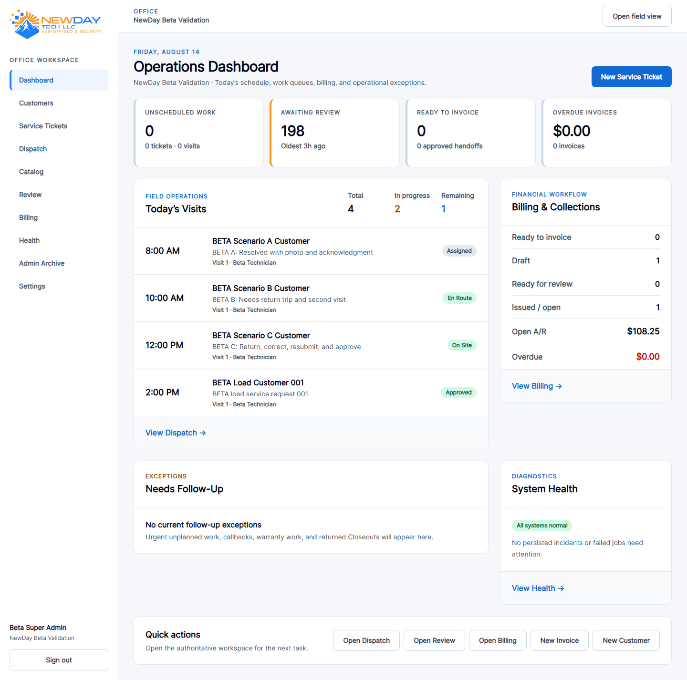
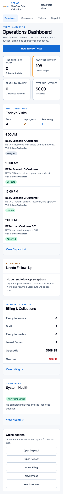
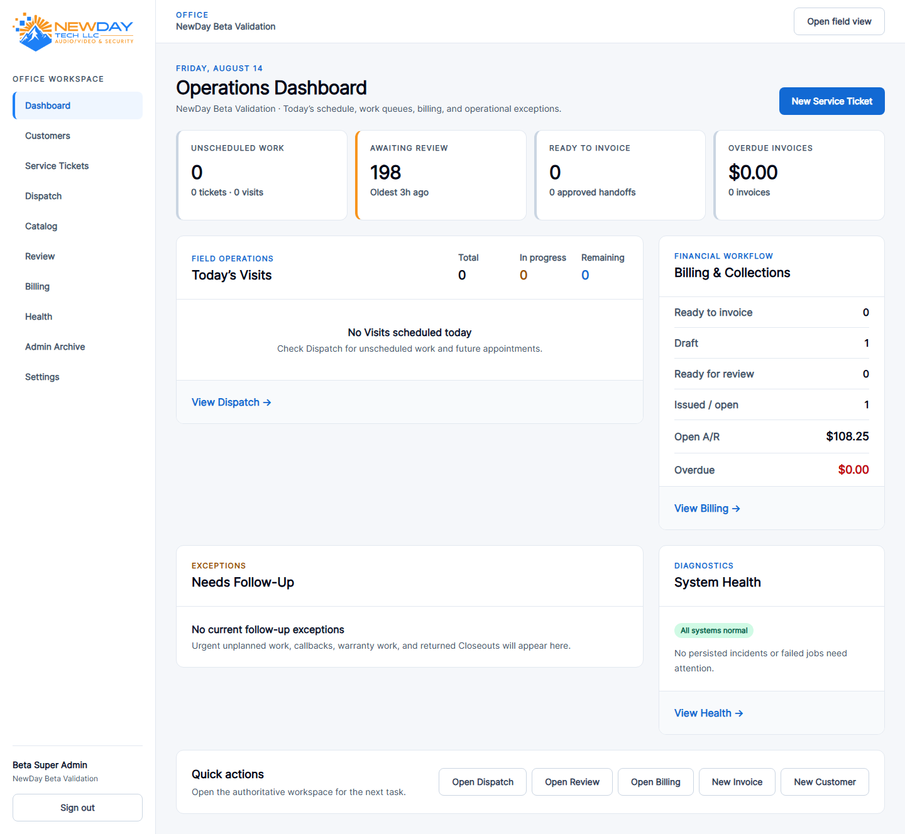
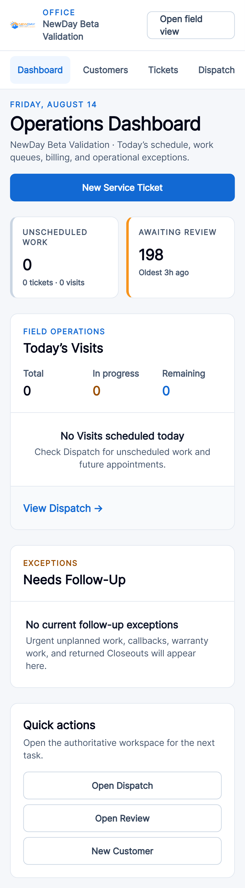

# Office Dashboard V1

## Delivery record

- Starting `main`: `e11159d6a7d39b47dd3465d46117fa0619a09dd8`
- Branch: `feat/office-dashboard-v1`
- Route: `GET /office` keeps the `office.home` route name and now uses `OfficeDashboardController@index`.
- Read model: `App\Support\OfficeDashboardSnapshot`
- Schema: unchanged
- Operational data: unchanged

The Dashboard is a read-only, organization-scoped command center. Every card or list links to an existing authoritative workspace; it adds no write endpoint, workflow state, or background refresh.

## Definitions

- **Unscheduled Work:** open/on-hold Service Tickets with no nonarchived Visit, plus noncanceled, nonarchived Visits without a scheduled start. A Ticket with an unscheduled Visit is represented only by the Visit count.
- **Awaiting Review:** submitted Closeouts without a review. The oldest submission is presented in the Organization timezone.
- **Ready to Invoice:** ready Billing Handoffs whose `current_invoice_id` is null. Completed Tickets are never used as a billing proxy.
- **Open A/R:** positive balances on issued Invoices using the same paid-minus-refunded balance SQL as the Invoice workspace.
- **Overdue A/R:** positive issued-Invoice balances with `due_on` before the Organization-local date.
- **Today's Visits:** noncanceled, nonarchived Visits whose scheduled start falls inside the Organization-local calendar day. Planned/scheduled/assigned are remaining; en-route/on-site/pending-closeout are in progress; approved/customer-unavailable are completed. Returned-for-correction is presented in Follow-Up rather than counted as active field execution.
- **Follow-Up:** at most eight open/on-hold Tickets matching urgent/high without a Visit, callback, warranty, returned-for-correction, or customer-unavailable updated in the previous seven days. A Ticket appears once with all applicable labels.
- **Health:** persisted open organization/global incidents and the global failed-job count. Loading the Dashboard never invokes the health scanner.

All displayed Visit and Follow-Up collections are bounded to eight records. The oldest-overdue list is bounded to three records.

## Capability visibility

| Module | Required capability |
| --- | --- |
| Unscheduled, Today's Visits, Follow-Up | `service_tickets.view` |
| Awaiting Review | `closeouts.inspect` |
| Ready to Invoice | `billing_handoffs.view` |
| Invoice states, Open A/R, Overdue | `invoices.view` |
| System Health | `operations.health.view` |

Quick actions use their existing read/write capabilities. Explicit membership overrides and inactive-membership restrictions remain authoritative.

Representative seeded-role behavior:

- Super Admin sees every module and all permitted actions.
- Dispatcher sees operations and Closeout inspection, but no invoice or health data.
- Reviewer sees Closeout inspection and the existing read-only Invoice summary, but no Billing Handoff count or health data.
- Billing sees Billing Handoffs and Invoice summaries, but no Dispatch, review, or health data.

## Validation

- Focused Dashboard tests: 4 passed, 51 assertions.
- Full PHPUnit: 296 passed, 2,450 assertions in 97.41 seconds.
- Query regression: fully privileged snapshot stays within 25 queries.
- Beta benchmark (`250` Customers, `400` Locations, `500` Tickets, `1,000` Visits, `200` Closeouts, `500` media rows): Dashboard warm p95 `9.3 ms`, maximum `14` queries.
- Organization isolation, Organization-local Today boundary, partial-payment/refund balance math, paid/void exclusion, overdue behavior, and nonbillable Ticket behavior: passed.
- Beta fixture/integrity validation: passed; 8 tests, 52 assertions.
- Pint: passed.
- Composer validation: passed.
- Composer audit: no security advisories.
- Compiled Blade lint: 166 files passed.
- Vite production build: passed in 980 ms.
- Playwright/axe: 10 passed, 10 expected project skips; Dashboard checked at 390, 768, 1280, 1440, and 1920 pixels with no horizontal overflow or serious/critical axe violations.
- `git diff --check`: passed.

## UI review

Populated Dashboard screenshots use temporary records scheduled into the Organization-local review day in the isolated beta database. `composer beta:setup` was rerun immediately afterward, restoring the deterministic beta fixture. Sparse screenshots preserve the zero-state presentation. No development or operational database was reset.

### Privileged desktop — populated

### Privileged phone — populated

### Privileged desktop — sparse

### Restricted-role phone

Additional populated captures are provided at 768, 1280, and 1920 pixels in `docs/ui-review/office-dashboard-v1`.

## Deferred

Dashboard V1 intentionally excludes financial trend reporting, A/R aging buckets, service KPIs, technician utilization, proposal/project pipeline, recurring-service metrics, customer risk scoring, polling, WebSockets, and materialized analytics.
