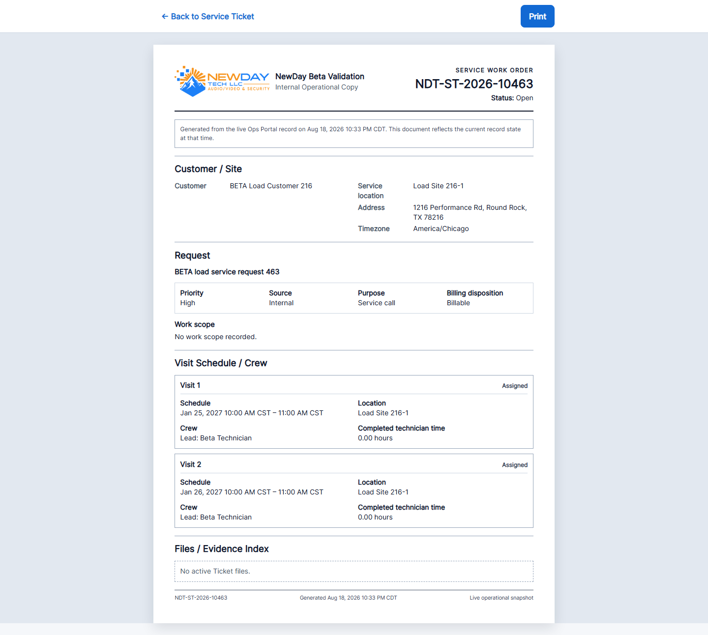
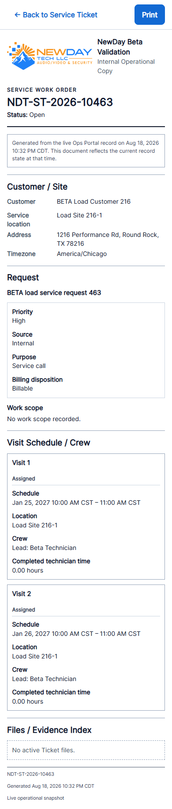
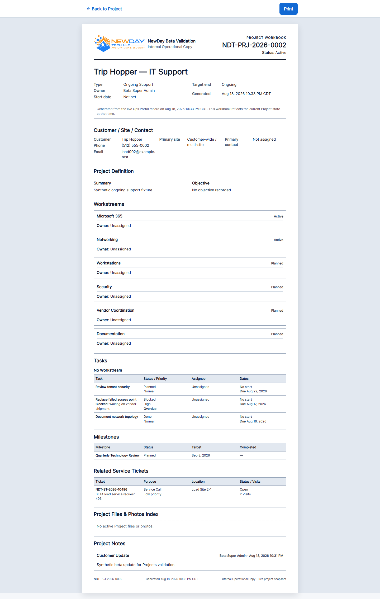
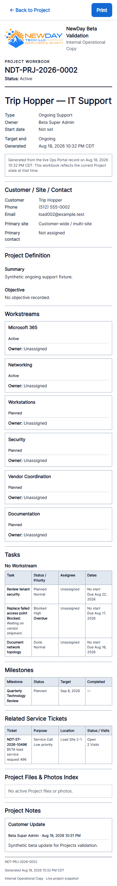

# Printable Operational Documents V1

## Baseline and delivery

- Authoritative baseline: `c73171736fcef6eb7d389a68b81edb6da8692541`, the merge commit for Project Attachments PR #35.
- Baseline GitHub Actions: [run 32209779161, attempt 2](https://github.com/jonathanodom/ops-portal-v2/actions/runs/32209779161) passed. Attempt 1 was canceled after its browser runner stalled for approximately 30 minutes; the unchanged rerun passed.
- Baseline local PHPUnit: 349 tests, 2,849 assertions in 244.19 seconds.
- Delivery branch: `feat/printable-operational-documents-v1`.
- This change has no migration, document table, stored snapshot, server PDF renderer, or new product dependency.

## Documents

### Service Ticket Work Order

`GET /office/service-tickets/{serviceTicket}/print` renders a `SERVICE WORK ORDER` from current canonical Ticket data. It includes Organization branding, Ticket identity and status, Customer/Site/Contact, request context, bounded related Projects, Visits, schedules, crew, ticket-relative Visit identity, safe technician-time totals, authorized submitted-closeout summaries, operational part quantities, evidence category counts, and active Ticket-file metadata.

It never renders Audit history, invoice/payment information, processor details, storage keys, private URLs, unrelated Customer history, or Project Notes. Users without `closeouts.inspect` receive only the Closeout status, matching the existing Office evidence boundary.

### Project Workbook

`GET /office/projects/{project}/workbook/print` renders a multi-section `PROJECT WORKBOOK` from current canonical Project data. It includes Project cover/context, Customer/Site/Contact or a clean Internal Project state, definition, Workstreams, grouped Tasks with a final No Workstream group, plain-text overdue/blocking semantics, Milestones, compact related Service Tickets with Visit counts, Project attachment metadata, and Project Notes.

It never renders Project Audit activity, storage keys, private attachment URLs, or full Ticket/Visit details.

## Architecture and authorization

- `ServiceTicketWorkOrderQuery` and `ProjectWorkbookQuery` own bounded, read-only eager loading and Organization-local generated timestamps.
- `ServiceTicketPrintController` and `ProjectWorkbookPrintController` are narrow GET-only controllers.
- The Work Order uses `ServiceTicketPolicy::view`; the Workbook uses `ProjectPolicy::view`.
- Existing active-membership capability overrides remain authoritative. Cross-Organization identifiers resolve as tenant-safe 404 responses.
- The Project query continues to use `CustomerDirectory` and `ServiceOperationsDirectory` immutable cross-domain projections. Those DTOs now carry the already-canonical contact fields, location timezone, and bounded Visit count needed by the Workbook.
- Rendering performs no writes or lifecycle transitions.

## Live snapshot and privacy behavior

Both documents display the authoritative record number and an Organization-local generated-at timestamp with explicit live-snapshot wording. They are not issued, certified, versioned, or archived artifacts.

Responses include:

- `Cache-Control: private, no-store`
- `X-Content-Type-Options: nosniff`
- `X-Robots-Tag: noindex, nofollow`
- `Referrer-Policy: no-referrer`

The routes require an authenticated Office session and expose no public/share token.

## Print design

The dedicated `x-layouts.print` layout excludes the Office sidebar, utility header, and mobile navigation. A screen-only toolbar provides Back and Print actions; it never opens the browser print dialog automatically. The Print action calls `window.print()`.

The stylesheet targets US Letter portrait with a `0.45in` page margin, dark-on-white grayscale-friendly output, repeating table headers where supported, break-resistant compact records, major Workbook page breaks, natural wrapping for long content, and no print-time JavaScript dependency. Screen preview remains responsive from 390 through 1,920 pixels while retaining a paper-document presentation.

## Query and validation results

- Focused printable-document tests: 5 passed, 69 assertions.
- Related Projects, Ticket, Ticket-file, Visit/Closeout regression slice: 85 passed, 684 assertions.
- Measured request ceilings, including authentication/membership middleware: Work Order at or below 28 queries; Project Workbook at or below 32 queries. Counts stay bounded because relationships are eager loaded without per-row lookups. Binary attachment/media content and Audit histories are never loaded.
- Focused Playwright Chromium/axe print scenario: 1 passed in 36.9 seconds. It exercised both documents at 390, 768, 1,280, 1,440, and 1,920 pixels, normal and emulated print media, toolbar visibility, absent Office navigation, overflow, and serious/critical axe checks.
- Full PHPUnit regression: 354 tests, 2,918 assertions passed in 116.43 seconds.
- Full Playwright/axe regression: 22 applicable scenarios passed and 18 intentionally project/screenshot-only scenarios skipped in 2.1 minutes; no serious or critical violations were reported.
- Beta validation: exact expected fixture counts passed, SQLite integrity passed, and 8 hardening tests / 56 assertions passed.
- Warm p95 benchmark: Office Dashboard 9.6 ms / 14 queries; Today 9.4 ms / 9; Dispatch 23.1 ms / 15; Projects workspace 14.6 ms / 16; Project detail 20.8 ms / 25; Ticket detail 16.1 ms / 23; Review detail 15.2 ms / 28; media first byte 0.0 ms.
- Compiled Blade syntax: 175 files passed.
- Vite production build, Pint, Composer strict validation/audit, and `git diff --check`: passed.

GitHub Actions results for the delivery branch are recorded in the draft PR when the remote run completes.

## Review images

### Service Work Order

### Project Workbook

## Known limitations and future candidates

Browser Print / Save as PDF is the only V1 output. The live view is not an immutable record of what was previously printed. Project and Ticket file bodies are indexed but not embedded. Page numbering and stored revisions are not provided.

Future work may separately consider completion reports, Project handoff/as-built packets, Dispatch day sheets, immutable issued snapshots, server-side PDFs, email delivery, e-signatures, or customer portal downloads. None are introduced here.
