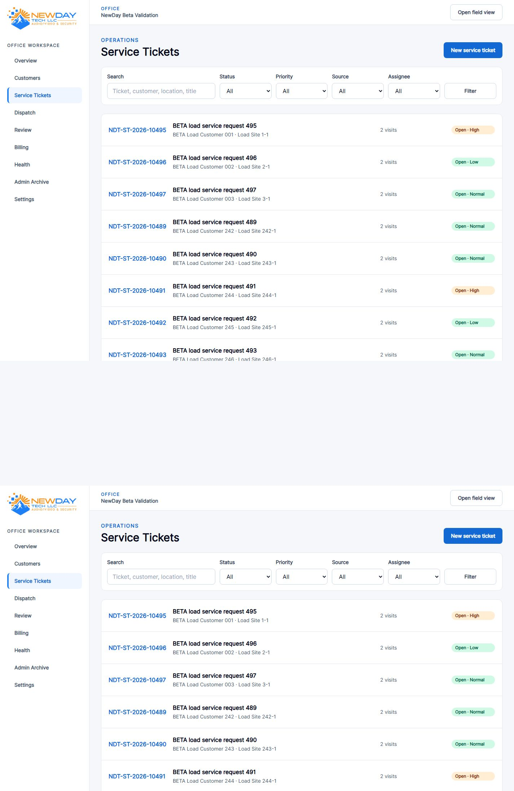
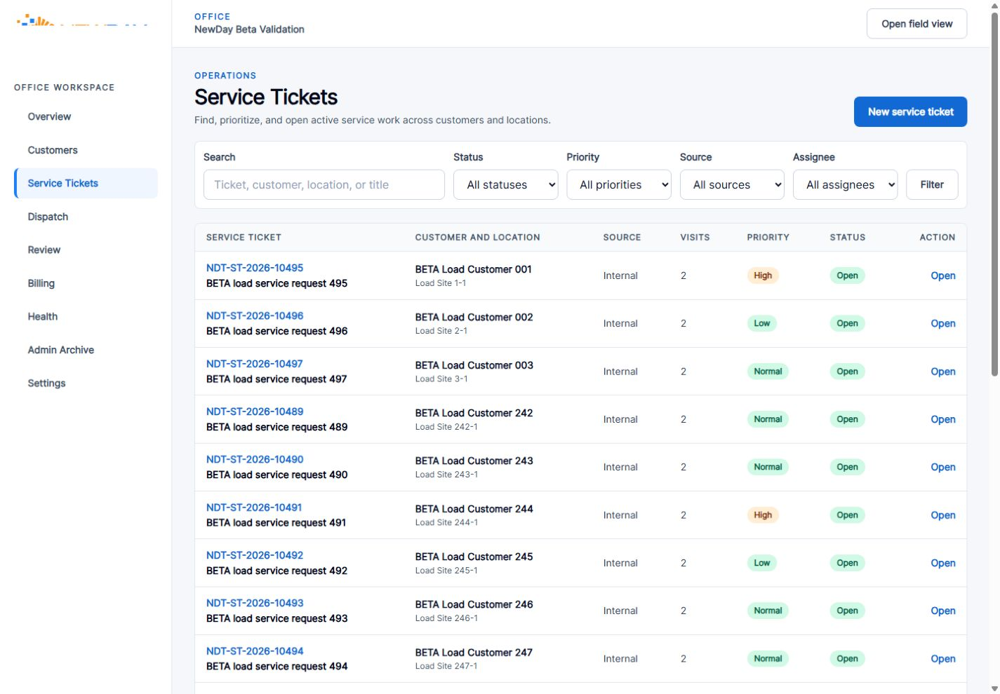
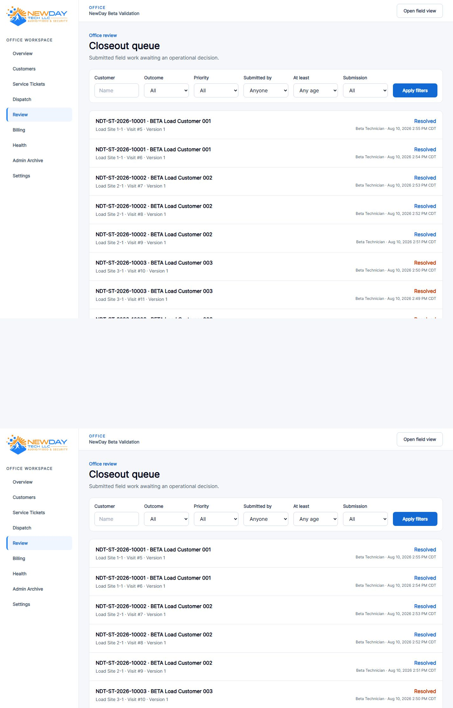
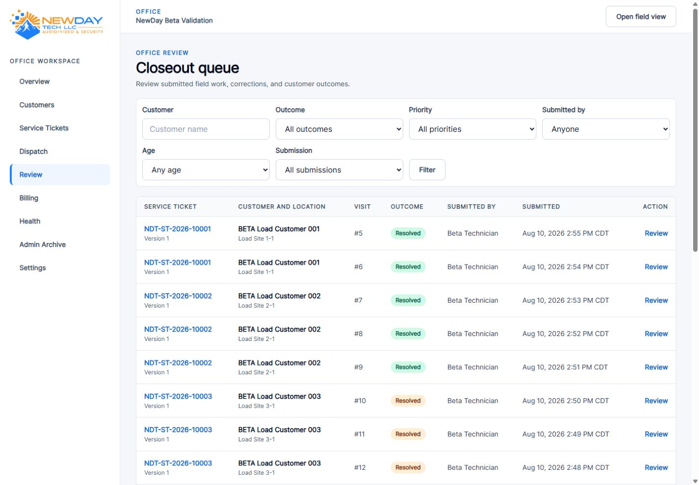
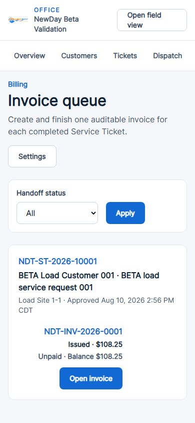
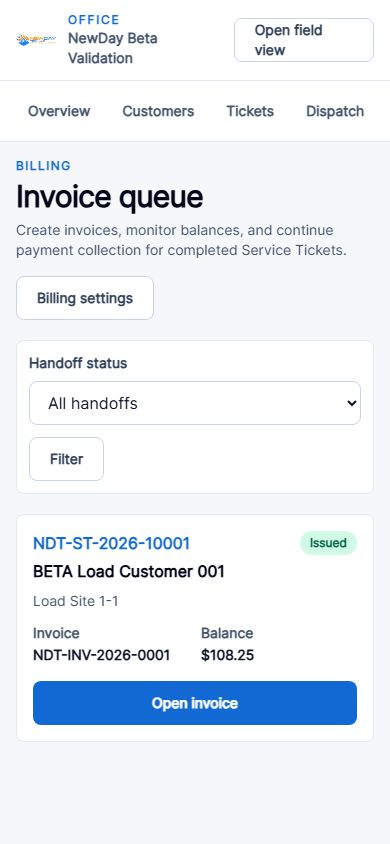
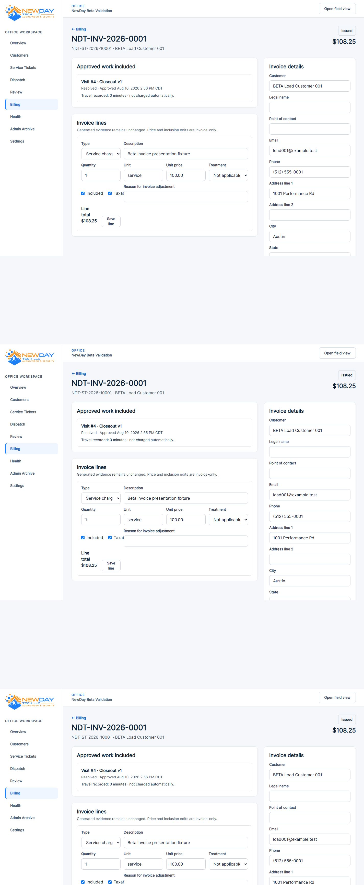
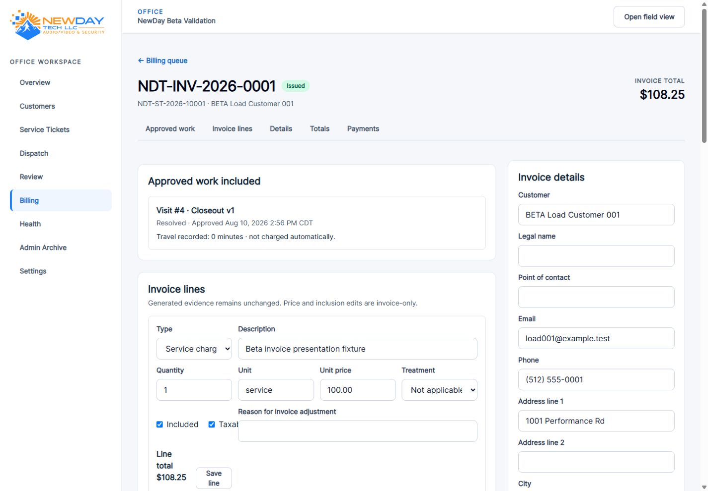

# UI Test — Checkpoint 3

## Baseline

- Originating `main` merge SHA: `42cc85180c56bf61c5e0a5483ad7613ece9ee51e`
- Branch: `ui-test/desktop-workspace-refinement`
- Scope: presentation-only refinement of Service Tickets, Closeout Review, Billing, Invoice, and Payment workspaces
- Database, routes, controllers, policies, FSM transitions, invoice calculations, and payment behavior: unchanged

The baseline passed 117 PHPUnit tests with 910 assertions under PHP 8.4 with Argon2. The workstation shell's alternate PHP binary lacks Argon2 and was not used for authoritative validation.

## Design decisions

- Service Tickets, Closeout Review, and Billing use the approved `workspace` width mode.
- Operational filters use concise labels, explicit Filter/Clear actions, and the shared flat toolbar.
- Queue data uses dense desktop tables at `lg` and compact cards below `lg`.
- Columns expose only relationships and calculations already loaded by existing controllers.
- The combined Billing queue continues to represent invoice and payment progress; no new navigation concept or route was introduced.
- Invoice detail uses the approved `detail` width, record header, contextual side rail, and in-page section navigation.
- Payment controls remain inside the authorized Invoice detail projection and retain all existing capabilities and safeguards.

## Before and after

### Service Tickets — desktop

| Before | After |
| --- | --- |
|  |  |

### Closeout Review — desktop

| Before | After |
| --- | --- |
|  |  |

### Billing — phone

| Before | After |
| --- | --- |
|  |  |

### Invoice and Payments — desktop

| Before | After |
| --- | --- |
|  |  |

All four views were also captured at 390px and 1440px. Automated browser validation covers 390, 768, 1280, 1440, and 1920px.

## Viewport observations

- 390px: operational queues use touch-friendly cards; filters stack; invoice sections and side rail form one readable column.
- 768px: cards retain a compact scan pattern without forcing horizontal tables.
- 1280px and 1440px: queue tables expose operational columns without wasted desktop space; invoice detail uses a two-column work/rail layout.
- 1920px: workspace pages occupy nearly all content area after the sidebar and gutters; invoice detail remains capped near 1600px.
- No horizontal page overflow was observed at the five required widths.

## Changed presentation files

- `resources/views/office/service-tickets/index.blade.php`
- `resources/views/office/closeout-reviews/index.blade.php`
- `resources/views/office/billing-handoffs/index.blade.php`
- `resources/views/office/invoices/show.blade.php`
- `tests/Feature/ServiceTicketVisitControlPlaneTest.php`
- `tests/Feature/CloseoutReviewBillingHandoffTest.php`
- `tests/Feature/Phase6InvoicingTest.php`
- `tests/Browser/beta-accessibility.spec.js`
- `docs/OFFICE_UI_DESIGN_SYSTEM.md`
- `docs/ui-review/checkpoint-3/**`

## Validation

- PHPUnit: **120 passed, 939 assertions**.
- Focused workspace feature tests: **3 passed, 29 assertions**.
- Composer validation: strict validation passed.
- Composer audit: no security vulnerability advisories.
- Pint: passed.
- Compiled Blade cache and PHP syntax lint: passed.
- Vite production build: passed.
- Diff checks: passed.
- Isolated beta fixture: exact expected counts passed (250 customers, 400 locations, 500 Service Tickets, 1,000 Visits, 200 closeouts, and 500 media records).
- Beta hardening: **8 passed, 50 assertions**.
- Playwright/axe: **7 applicable tests passed, 7 opposite-project tests skipped** across desktop and mobile projects.
- Manual browser review: 390, 768, 1280, 1440, and 1920px; no horizontal overflow after correcting the intermediate-width Closeout Review filter grid.

Local Playwright was run with one worker because parallel desktop/mobile Chromium workers crashed under Windows workstation resource contention. The same assertions and both configured projects completed successfully in the serial run.

## Known inconsistencies and recommendation

- Dispatch, Health, Archive, and Settings retain their established module-specific layouts; this checkpoint intentionally did not broaden scope.
- Invoice line editing remains information-dense because all Phase 6 controls remain visible and unchanged.
- Recommendation: merge after visual approval if the wider queues and structured invoice hierarchy match the approved direction.
