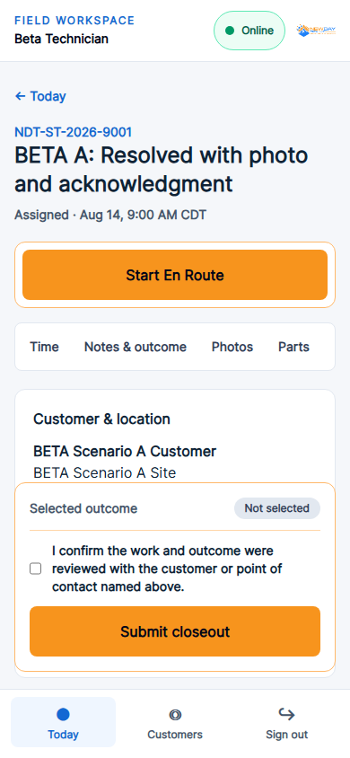
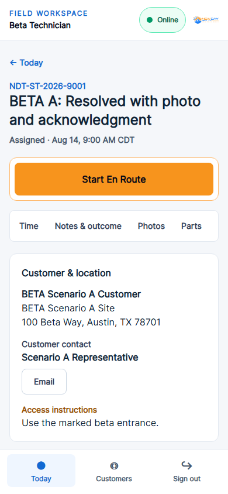
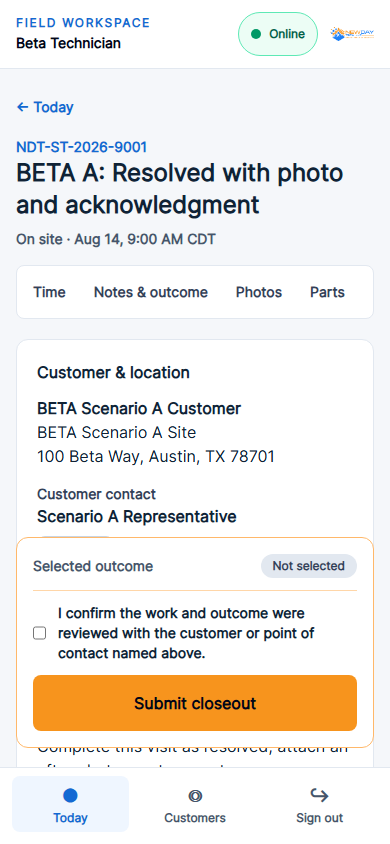
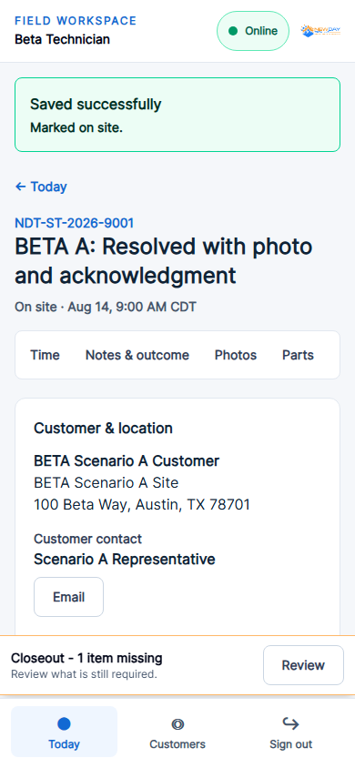

# Release Candidate V1.0 — Field Closeout comparison

These 390×844 screenshots compare the exact pre-Checkpoint-8 commit (`075a136`) with the Release Candidate implementation. They use the same isolated beta scenario, technician, and viewport.

## Assigned

| Before | After |
| --- | --- |
|  |  |

Before, the large Closeout panel competes with **Start En Route**. After, Closeout is absent and the current execution action owns the workspace.

## On Site

| Before | After |
| --- | --- |
|  |  |

Before, acknowledgment and submission controls permanently consume the bottom of the viewport. After, a compact status/action row opens the existing accessible final-review dialog.
